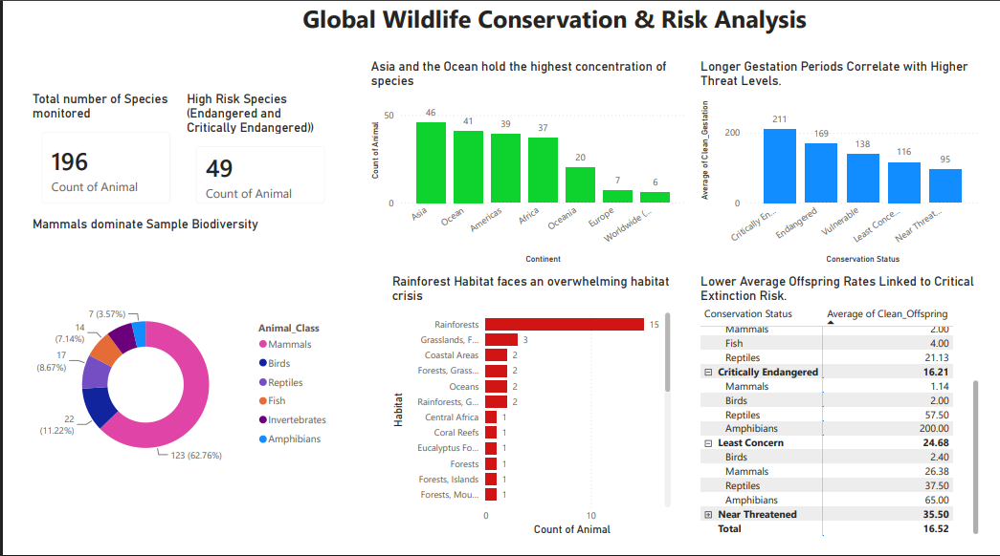

# Global Wildlife Conservation and Risk Analysis Dashboard

## Project Overview
This project delivers an end-to-end data engineering and analytics pipeline designed to uncover insights into global animal extinction threats. By cleaning messy raw records in Python, building a structured relational database in MySQL, and designing an executive-ready Power BI dashboard, this project models the exact data lifecycle used in professional environments.

### Finished Dashboard Preview

---

## Tech Stack and Skills Demonstrated
* Data Engineering and Cleaning: Python (Pandas, NumPy)
* Database Management: MySQL Workbench (Relational schema modeling, Connection strings)
* Data Visualization and Analytics: Power BI Desktop
* Core Competencies: Advanced conditional mapping, hierarchical matrix design, edge-case debugging, and actionable insights reporting.

---

## Key Business and Biological Insights

### 1. The Reproductive Trait Hypothesis (Gestation)
The data reveals a clear correlation between slow reproduction cycles and critical threat status. Species classified as Critically Endangered or Endangered exhibit the highest average gestation periods, meaning their populations take significantly longer to recover from environmental shocks.

### 2. Offspring Demographics Explained via Class Hierarchies
A high-level view originally suggested no clear linear correlation between conservation status and offspring count. However, utilizing a hierarchical matrix breakdown by Animal Class uncovers a critical biophysical trend:
* Threatened mammals consistently maintain tiny litter sizes across all risk tiers, averaging only 1 to 4 offspring.
* The statistical spikes in categories like Critically Endangered (average of 16.21) or Near Threatened (average of 35.50) are heavily skewed by egg-laying species. For instance, Critically Endangered Amphibians average 200.00 offspring, while Near Threatened Fish average 300.00 offspring per cycle to offset high juvenile mortality rates.

### 3. Rainforest Ecosystem Crisis
Rainforest habitats overwhelmingly dominate the list of high-risk ecosystems, containing 15 critically endangered or endangered species. This volume outnumbers all other environments combined, identifying the biome as the highest priority area for capital allocation and active field conservation.

### 4. Regional Hotspots
Asia and general Ocean biomes host the highest volume of high-risk species monitored in this dataset, highlighting key geographic zones requiring immediate global policy intervention.

---

## How the Pipeline Works

### 1. Data Cleaning and Transformation (Python)
* Restructured raw textual data into clean categories.
* Isolated and resolved mixed groupings, such as separating independent classes for Reptiles and Amphibians.
* Handled structural errors and edge-case exceptions, such as hardcoding custom regional overrides for species like the Arabian Oryx.
* Engineered numeric proxies for gestation and offspring tracking.

### 2. Database Storage (MySQL)
* Automated data schema creation and pipeline transfer using SQLAlchemy directly from Python.
* Hosted records locally to ensure high-performance data storage and seamless visualization connections.

### 3. Business Intelligence (Power BI)
* Engineered high-level summary KPI cards targeting absolute species volume vs. active high-risk counts.
* Formatted analytical distribution visuals and dynamic matrix hierarchies to allow zero-guess readability for executives.
